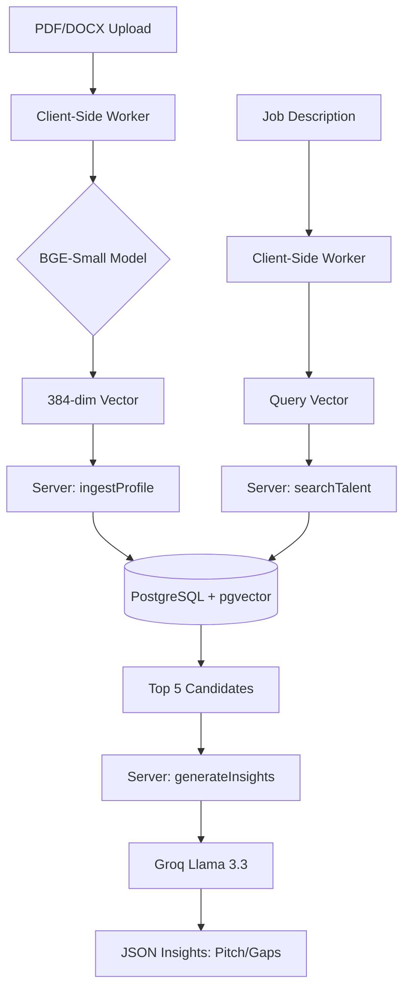

# Recruiter Matchmaker: Technical Specification & KT

## Overview
The Recruiter Matchmaker is a semantic search and RAG-based candidate analysis engine. It allows recruiters to search through a private talent pool using natural language Job Descriptions (JDs) rather than rigid keyword filters.

## Architecture

## Step-by-Step Execution Flow

### 1. Engine Initialization
*   When the user visits `/recruiter`, the `RecruiterClient` initializes a Web Worker.
*   The worker downloads the `bge-small-en-v1.5` ONNX model (~34MB).
*   The model is cached in the browser's IndexedDB, so subsequent visits are near-instant.

### 2. Candidate Ingestion
*   **Parsing:** The user uploads a PDF or DOCX. The client-side `UploadZone` extracts the raw text.
*   **Embedding:** The raw text is sent to the Web Worker. The BGE model converts the text into a 384-dimensional numerical vector.
*   **Deduplication:** A SHA-256 hash of the normalized text is generated to prevent duplicate resumes in the pool.
*   **Storage:** The `ingestProfile` server action saves the text, hash, and vector (cast to the `vector` type) into PostgreSQL.

### 3. Semantic Search
*   **Query Embedding:** The user enters a Job Description. The client embeds this JD into a query vector using the same Web Worker.
*   **Vector Ranking:** The query vector is sent to the `searchTalent` server action.
*   **Distance Calculation:** PostgreSQL performs a cosine similarity search (`embedding <=> query_vector`) using the HNSW index to find the closest matches.
*   **Scoring:** Raw distances (0.0 to 2.0) are calibrated into a 0-100% "Match Score" for human readability.

### 4. RAG Insight Generation
*   **Retrieval:** The server fetches the full `rawText` for the top 5 candidates.
*   **Context Preparation:** Each resume is sliced to the first 4,000 characters to ensure the LLM stays focused and remains within token limits.
*   **LLM Analysis:** The JD and the 5 resume blocks are sent to Groq (Llama 3.3).
*   **Structured Output:** The LLM analyzes the fit and returns a JSON object containing a customized pitch, missing skills list, and potential concerns for each candidate.

## Technical Concepts

### BGE (BAAI General Embedding)
BGE is a state-of-the-art embedding model family developed by the Beijing Academy of Artificial Intelligence. It is optimized for retrieval tasks and consistently ranks at the top of the Massive Text Embedding Benchmark (MTEB). The "small" version (384 dimensions) is used here because it offers an ideal balance between accuracy, memory footprint, and search speed.

### Vectors and Dimensions
A vector is a numerical representation of a document's meaning. The BGE model produces a 384-dimensional vector for every resume. Each "dimension" represents a learned feature or concept (e.g., technical skill level, domain expertise, management experience). By placing resumes into this 384-dimensional space, the system can calculate the mathematical "distance" between a job description and a candidate, identifying matches that keyword-based search would miss.

## Core Decisions & Rationale

### 1. Client-Side Embeddings (Transformers.js)
*   **Decision:** Run `Xenova/bge-small-en-v1.5` in a Web Worker.
*   **Rationale:** 
    *   **Privacy:** Raw resume text doesn't need to leave the client for embedding.
    *   **Cost:** $0 server cost for generating vectors.
    *   **Performance:** Model (~34MB) is cached in IndexedDB after first load.

### 2. Document-Level RAG (The "No-Chunking" Strategy)
*   **Decision:** Store one vector per resume and slice the LLM context at 4,000 characters.
*   **Rationale:**
    *   **Semantic Integrity:** Resumes are short (1-2 pages). Splitting them into chunks loses the "global context" of the candidate's seniority and career progression.
    *   **Efficiency:** Retrieval is a simple 1:1 match.
    *   **Prompt Window:** 4,000 characters (~1,000 tokens) captures the most relevant/recent 80-90% of a resume while keeping LLM latency extremely low.

### 3. Vector Database (pgvector + HNSW)
*   **Decision:** Use `embedding <=> $1::vector` (Cosine Distance) with an HNSW index.
*   **Rationale:** HNSW provides sub-100ms retrieval speed even at scales of 10k+ resumes.

## Maintenance & Scaling

### Environment Variables
*   `GROQ_API_KEY`: Required for insights generation.
*   `GROQ_MODEL`: Defaulting to `llama-3.3-70b-versatile` for high-quality reasoning.

### Accuracy Testing
A custom evaluation harness lives in `eval/`. It calculates:
*   **Recall@10**: Percentage of relevant candidates found in the top 10.
*   **MRR (Mean Reciprocal Rank)**: How high up the "perfect" match appears.
*   **Current Baseline:** 1.00 Recall@10 on synthetic fixtures.

## Potential Gotchas
*   **Triggers:** If the database schema changes, ensure the manual HNSW index migration is re-applied.
*   **Truncation:** If a candidate has a 50-page portfolio as a PDF, only the first ~4,000 characters are sent to the LLM. 
